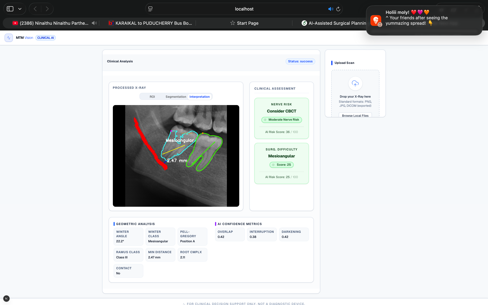

# Explainable AI Decision Support for Third Molar Nerve Risk and Surgical Planning


*(Example output demonstrating the clinical assessment, including nerve risk, surgical difficulty, and geometric analysis)*

## 💡 Overview

This project provides an **Explainable AI (XAI)** decision-support system tailored for dental professionals and maxillofacial surgeons. It evaluates the surgical difficulty and the risk of Inferior Alveolar Nerve (IAN) injury during the extraction of Mandibular Third Molars (MTM).

Unlike "black-box" AI systems that only provide a final prediction, this pipeline is designed explicitly for **clinical transparency**. It breaks down the decision-making process into interpretable steps, extracting geometric features (e.g., Winter's angle, minimum distance to the nerve canal) from radiographs and using them to compute a transparent risk score, acting as an assistive tool rather than an autonomous diagnostic device.

## 🚀 Key Features

*   **Multi-Stage Interpretable Pipeline:** Uses independent models for ROI detection, precise segmentation, and geometrical feature extraction, allowing clinicians to verify each step.
*   **Geometric Rule Engine:** Automatically calculates standard clinical parameters including Winter's Classification, Pell & Gregory Ramus/Depth Classification, and precise distances/angles.
*   **ANFIS Risk Scoring:** Employs an Adaptive Neuro-Fuzzy Inference System (ANFIS) to convert geometric measurements into a comprehensive risk score and surgical difficulty index mimicking human clinical reasoning.
*   **Clinical-Grade UI:** A modern, clean frontend built to provide quick insights, AI confidence metrics, and robust visual overlays on dental panoramic radiographs (OPGs).

## 🧠 System Architecture

The pipeline consists of four main stages:

1.  **Object Detection (ROI Extraction):** A YOLOv8 model identifies the bounding box containing the mandibular third molar and the associated inferior alveolar nerve canal.
2.  **Semantic Segmentation:** Specialized models segment the exact pixel boundaries of the tooth and the nerve canal.
3.  **Geometric Analysis:** A deterministic rule-engine extracts clinical parameters such as minimum distance, tooth angulation, root complexity, and overlap ratio.
4.  **Fuzzy Inference (ANFIS):** The extracted features are fed into a trained ANFIS model which outputs a risk score (0-100) and provides suggestions (e.g., "Consider CBCT", "Moderate Nerve Risk").

## 🛠️ Technology Stack

*   **Frontend:** Next.js, React, TypeScript, TailwindCSS
*   **Backend:** FastAPI, Python, Uvicorn
*   **Machine Learning / AI:** PyTorch, Ultralytics (YOLO8), OpenCV, ANFIS, Scikit-Image

## ⚙️ Setup & Installation

### Backend Setup

```bash
cd Backend
python -m venv venv
source venv/bin/activate  # On Windows: venv\Scripts\activate
pip install -r requirements.txt
python -m uvicorn app.main:app --reload
```

### Frontend Setup

```bash
cd Frontend
npm install
npm run dev
```

## ⚠️ Disclaimer

This system is for **clinical decision support and research purposes only**. It is not a diagnostic device. Final clinical decisions must always be made by a qualified healthcare professional.
